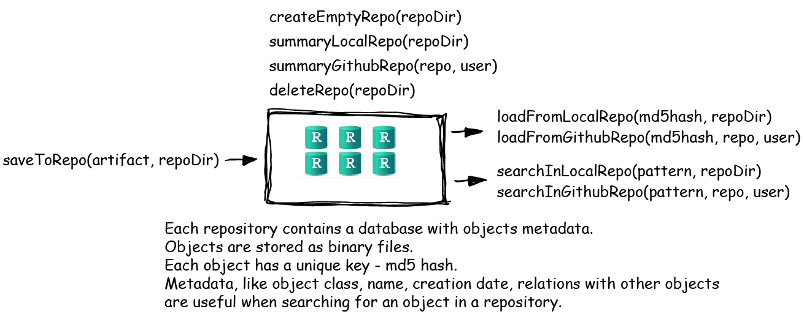

```{r, echo=FALSE}
library(knitr)
opts_chunk$set(comment="", message=FALSE,fig.width=4, fig.height=3,tidy.opts=list(keep.blank.line=TRUE, width.cutoff=40),options(width=70), size='footnotesize', warning=FALSE)
```


# Do czego służy **archivist**?


- pozwala **magazynować i archiwizować** obiekty \text{w repozytoriach} przechowywanych na dysku bądź na Githubie
- udostępnia proste w obsłudze funkcje uprawniające **szukanie** 
\text{i \textbf{odzyskiwanie}} obiektów
- wspiera filozofię **powtarzalnych badań** \text{(\textit{reporoducible research})}
- idealnie sprawuje się jako **pamięć podręczna**


# Jak działa **archivist**?



# Case Study: Pamięć podręczna
\ \newline
Funkcja `getMaxDistribution()` podsumowuje rozkład maksimum z N niezależnych obserwacji z rozkładu D dla R replikacji.
```{r, cache=TRUE}
getMaxDistribution <- function(D = rnorm, N = 10, 
                               R = 1000000) {
  res <- replicate(R, max(D(N)))
  summary(res)
}
system.time( getMaxDistribution(rnorm, 10) )
system.time( getMaxDistribution(rexp, 20) )
```

# Case Study: Pamięć podręczna
Spróbuj sam. Funkcję można łatwo pobrać z repozytorium przechowywanego na Githubie.
```{r, eval=FALSE}
install.packages("archivist")
library("archivist")
# library(devtools)
# install_github("pbiecek/archivist")

loadFromGithubRepo("c", user="MarcinKosinski", 
                   repo="Museum")
```

# Case Study: Pamięć podręczna

```{r, cache=TRUE}
cache <- function(cacheRepo, FUN, ...) {
  tmpl <- list(...)
  tmpl$.FUN <- FUN
  outputHash <- digest(tmpl)
  isInRepo <- searchInLocalRepo(paste0("cacheId:", 
                        outputHash), cacheRepo)
  if (length(isInRepo) > 0)
    return(loadFromLocalRepo(isInRepo[1], repoDir = cacheRepo, value = TRUE))
  output <- do.call(FUN, list(...))
  attr( output, "tags") <- paste0("cacheId:", outputHash)
  attr( output, "call") <- ""
  saveToRepo(output, repoDir = cacheRepo, archiveData = TRUE,
             archiveMiniature = FALSE, rememberName = FALSE)
  output
}
loadFromGithubRepo("7", user="MarcinKosinski", 
                   repo="Museum")
```

# Case Study: Pamięć podręczna

Używając pakietu **archivist** można przygotować repozytorium przechowujące wywołania funkcji `cache()`, aby uniknąć ich powtórnego wywołania w przyszłości. 

```{r, echo=-1, cache=TRUE}
library(archivist)
cacheRepo <- tempdir()
createEmptyRepo( cacheRepo )
library( "digest" )
system.time( cache(cacheRepo, getMaxDistribution, 
                   rnorm, 10) )
system.time( cache(cacheRepo, getMaxDistribution, 
                   rexp, 10) )
```


# Case Study: Pamięć podręczna

Pierwsze wywołanie nie różniło się prędkością od zwykłego wywołania samej funkcji `getMax..`, jednak drugie wykorzystuje wyniki z pierwszego wywołania i jest o wiele szybsze.
```{r, cache=TRUE}
system.time( cache( cacheRepo, getMaxDistribution, 
                    rnorm, 10) )
```


# Inne przykłady

```{r, echo=-1}
library(archivist)
wykres <-loadFromGithubRepo( md5hash = "fcd7" , 
user = "pbiecek", repo = "graphGallery", value = TRUE)
print( wykres )
```

# Inne przykłady

```{r, eval=FALSE}
hash <- searchInGithubRepo( "name:crime", 
user="MarcinKosinski", repo="Museum", fixed = FALSE)
getTagsGithub( hash, user="MarcinKosinski",
                    repo="Museum")
```
```{r, echo=FALSE, cache=TRUE}
cat("name:crime.by.state %.% \nfilter(State == \"New York\",  Year == 2005) %.%   \n  arrange(desc(Count))   %.% \n select(Type.of.Crime, Count) %.%     \n mutate(Proportion = Count/sum(Count)) %.% \n group_by(Type.of.Crime) %.% \n     summarise(num.types = n(), counts = sum(Count))")
```


# Więcej?

Te i inne zastosowania można zobaczyć pod tymi linkami lub na stronie \href{http://pbiecek.github.io/archivist/}{http://pbiecek.github.io/archivist/}


[Cache with the archivist package](https://rawgit.com/pbiecek/archivist/master/vignettes/cacheUseCase.html)

[Retrieving all plots with other github repository (example with flights data from Hadley Wickham useR!2014 tutorial)](https://rawgit.com/pbiecek/archivist/master/vignettes/accessibilityUseCase.html)

[Archiving artifacts with their chaining code](https://rawgit.com/pbiecek/archivist/master/vignettes/chainingUseCase.html)

[Just get the object](https://rawgit.com/pbiecek/archivist/master/vignettes/justGetIT.html)

[Lazy load with **archivist**](https://rawgit.com/pbiecek/archivist/master/vignettes/lazyLoadUseCase.html)


